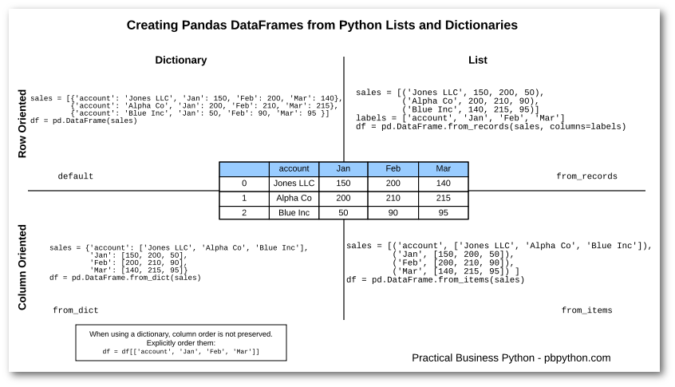

# Day-2 (Python Data Structures)

### SWBAT:
* Describe the difference between primitive and non-primitive data structures
* Perform data handling with Python lists by Storing, accessing and manipulating information in a list structure. 
* Perform data handling with Python dictionaries by Storing, accessing and manipulating information in a dictionary structure.
* Demonstrate the ability to data from external sources into Python environment
* Compare and constrast use cases for lists and dictionaries in python

### Python primitive vs. non-primitive data structures (15 minutes)
 
Explain the idea behind non-primitive vs. primitive data structures independant of programming platforms. 

**Primitive Data Structures**

A primitive data type is one that fits the base architecture of the underlying computer such as int, float, and pointer, and all of the variations, thereof such as char short long unsigned float double and etc, are primitive data type.

Primitive data are only single values, they have not special capabilities.

The examples of Primitive data types are given int, float, string, boolean etc.

The integer reals, logic data character data pointer and reference are primitive data structures data structure that normally are directly operated upon by machine level instructions are known as primitive structure and data type.

**Non-primitive Data Structures** 

A non-primitive data type is something else such as an array structure or class is known as the non-primitive data type.

The data type that are derived from primary data types are known as non-primitive data type.
The non-primitive data types are used to store the group of values.

Examples of non-primitive data type.

Array, lists, dictionaries, sets, stacks, queue etc.

(further details here)
https://www.datacamp.com/community/tutorials/data-structures-python
https://code.tutsplus.com/articles/advanced-python-data-structures--net-32748

### Introduction to Collections in Python (5 minutes)

We have seen some simple Python types like numbers, strings and booleans. Now we will see how we can group multiple values together in a collection – like a list of numbers, or a dictionary which we can use to store and retrieve key-value pairs. Many useful collections are built-in types in Python as non-primitive data types and as data scientists you will encounter them quite often while reading data from external sources and collecting it in one of the data types explained later in this lesson. 

http://python-textbok.readthedocs.io/en/1.0/Collections.html

#

### Python Lists Lesson (25 min) 
[Click here to access the lesson](https://github.com/learn-co-curriculum/python-lists-lab)

* Lists and operations in Python
* Creatig lists 
* List indexing , acessing elements
* Lists slicing , creating new lists from exitsing 
* adding new elements / destructuve elements
* Identifying unique elements by converting to sets 
* Length of lists with len()
* A quick exercise for students to practice above operations

### Python Lists Lab

#### Lists and Operations (20 min)
[Click here to access the lab](https://github.com/learn-co-curriculum/python-lists-lab)

#### Using lists for geo-visualisations using python folium library (20 min)
[Click here to access the lab](https://github.com/learn-co-curriculum/py-lists-with-maps)

#### Lists Discussion (10 minutes)
Answer any questions on lessons and labs on lists. 

### Python Dictionaries Lesson (20 min)
[Click to acces the lesson](https://github.com/learn-co-curriculum/python-dictionaries-readme)

* Intro to Python dict data structure 
* Dictionaries and Key-value pairs {k:v}
* Creating dictionaries and adding elements 
* Recalling elements from dictionay
* Dictionary of lists 
* lists of dictionaries

### Python Dictionaries lab (25 minutes)
Practice dictionary creation, modification and operations highlighted in the lesson above. 
[Click here to access the lab](https://github.com/learn-co-curriculum/python-dictionaries-lab/)

### Import from Excel into Python dictionaries (25 minutes)
[Click here to access the lab](https://github.com/learn-co-curriculum/excel-to-python)

As data scientists, you will be routinely importing data from external sources including text files, xls, csv, XML, JASON and relational databases, to name a few. Following lesson given a brief insight into opening an xl file and reading data to be procssed in Python. We will use Pandas module in python which has built in methods to read and write different data file formats. Provide a quick introduction to Pandas. Further details on Pandas and its applications will be later covered in the course. 

[Click here to access the lesson](lessons/xl_to_python.ipynb)

### Python Dictionaries discussion and quick introduction to additional data (Sets, Tuples etc) structures with use cases  (15 mins)

### Extra reading

Compare and contrast lists, dictionaries, tuples and sets and describe the use cases for each of these. Consult following slides for examples
https://www.slideshare.net/rampalliraj/learn-python-for-beginners-part2

## Summary: 

Today's lesson provided further insight into Python development environment with lists and dictionaries. We can now compare and contrast between use cases for both of these non primitive data types. We used data in lists to do some simple geographical visualisations using Python Folium library. The lesson highlighted how dictionaries can be used to store information as key: value pairs to ensure data integrity. As an extra lab, we also saw how to import data into pandas dataframe for processing.  

